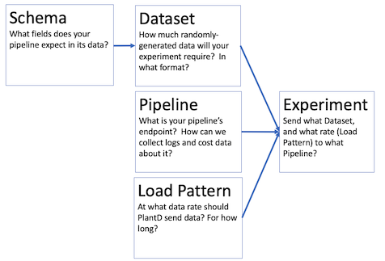

# Setting up an experiment

## Overview

Running an experiment in PlantD requires configuring
a linked set of resources: 

* A namespace
* One or more schemas: what fields does your pipeline expect in its data?
* A dataset: How much randomly-generated data will your experiment require? In what format?
* A load pattern: At what data rate shoudl PlantD send data? For how long?
* A Pipeline: What is your pipeline's endpoint? How can we collect logs and cost data about it?
* An Experiment: Send what Dataset, using what Load Pattern, to what Pipeline?

You can configure these through PlantD-Studio.

## Starting the PlantD Studio user interface

To start using PlantD, to set up and run an experiment, you will first
need to start the user interface.

Use the command described in the [Installation](docs/tutorial/installation.md) page
to get the hostname of the PlantD Studio interface, and paste the URL it
returns into a browser.  

If you are running on a remote cluster, this is the command:

`kubectl get svc plantd-studio-service -n plantd-operator-system -o jsonpath='{.status.loadBalancer.ingress[0].hostname}{"\n"}'`

## Namespaces

Most pages in PlantD have blanks for namespace.  This is a kubernetes
concept that just helps organize resources.  We recommend that you use
namespaces to organize your projects, since when you choose a namespace,
PlantD will show just the resources available within that namespace, so 
you will have fewer options to dig through when setting up connections
between your resources.

However you can combine resources from any arbitrary namespaces, so 
you are free to come up with other conventions for using namespaces.

## Schema

Create a schema to describe each kind of data your pipeline can receive.
The interface allows you to describe a set of named fields, of various
types, and some constraints on the values of those fields.  These schemas
will control PlantD's random data generator.  

## Dataset

Create a dataset to say what mix of schemas you want to provide to your
pipeline in a PlantD experiment.  Each unit of data sent may contain
a variety of schemas, possibly more than one.  There is some ability to 
control the format of data, for example binary files or CSV, and
compression method.

Of course, the ways data can be formatted are infinite, and the Dataset
configuration screen does not allow every possible format.  If the format
you need is not available, you will need to extend the open source PlantD
project to allow for the new format.  If you wish to offer that code back
to the PlantD community for others to use, we would be happy to review
a pull request with that extension.

When it comes to determining the size of your dataset, you will need to
do a back-of-napkin calculation about the rate of data you wish to send
to your pipeline, and for how long.

After you submit your parameters for the dataset, an indicator dot in the list of datasets
in the PlantD Studio interface will track the dataset's status.  It may take
a few minutes to generate the quantity of synthetic data that you have requested.
PlantD generates all the data first, before beginning an experiment, so that
data generation does not throttle the system's ability to generate fast load.

## Load Pattern

Here, you describe the duration and data rate of your experiment.  Data rate can linearly increase,
decrease, or stay steady, over segments of any length, so you can approximate any
load curve by piecing these segments together.

One initial load pattern we recommend is to slowly ramp up the rate from zero, up to
some rate significantly above what you believe the pipeline will handle, in order
to identify its nominal throughput, and see how it behaves when that throughput
rate is exceeded.

## Experiment

The Experiment screen simply includes references to namespace and name of a
Load Pattern, Dataset, and Pipeline.  You can start the experiment immediately, 
or schedule it to start at some future time.

Note that some pipelines have multiple ingestion endpoints -- if you plan to 
send data to these simultaneously, each will need its own dataset and load pattern
reference, and a pointer to the particular pipeline endpoint for each strea of data.

When you start an experiment, PlantD will mark the experiment's pipeline as "engaged",
until the end of the experiment.  It will not start another experiment until the
first one is done.

However, for now we still recommend starting each experiment manually, rather than
queueing up several at once.  PlantD is not yet perfect at recognizing when an 
experiment has ended: even after all the load has been sent, a pipeline may have
data queued, which could continue processing long after.  If another experiment is started at that time,
measurements of the pipeline's data will be tainted for BOTH experiments.

## Experimental results

Results can be viewed live, by clicking the links on the list of experiments.
One link shows the load data being fed into the experiment, and another shows
statistics about the pipeline's behavior during the experiment.

This data is still available after the experiment has concluded; so you can return
to it later to compare different experiments, or for posthoc analysis in the
Business Analysis features of PlantD.
